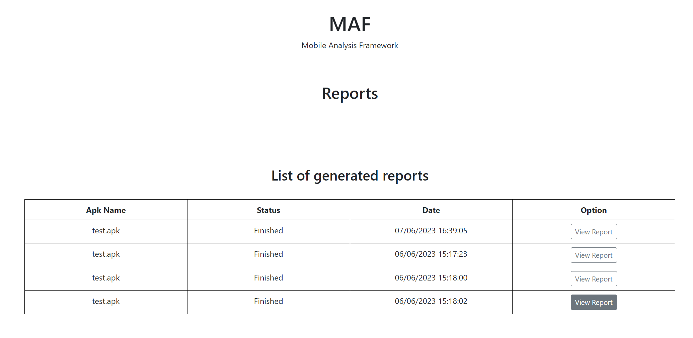
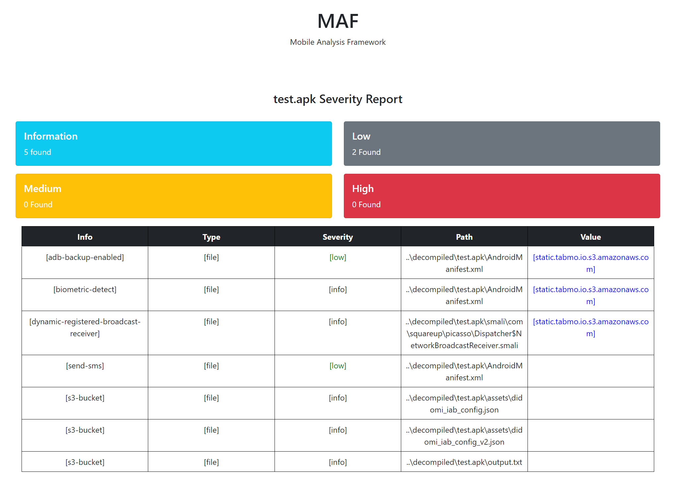

# MAF
Mobile Analysis Framework

Analyse APKs based on nuclei templates and create your own templates from WebUI

## Usage

- Run "flask run" command in cmd under "website" folder and go to localhost:5000
- Select an apk to start analyze

### Sample APK

- You can use sample apk under "sample" directory. 
- Warning! The sample apk contains malicious activity. Do not use on your personal devices.

